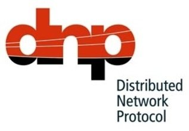
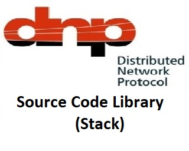
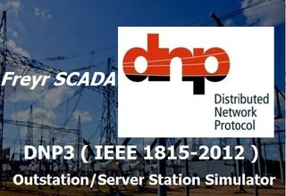
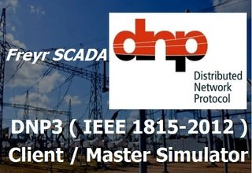
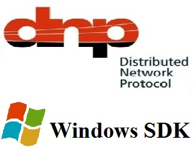
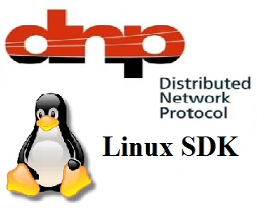

# [DNP3 Protocol](https://www.freyrscada.com/dnp3-ieee-1815.php)

Distributed Network Protocol 3 ( DNP3 ) is a set of communications protocols used between components in process automation systems. Its main use is in utilities such as electric and water companies. 

Usage in other industries is not common. It was developed for communications between various types of data acquisition and control equipment. It plays a crucial role in SCADA systems, where it is used by SCADA Master Stations (a.k.a. Control Centers), Remote Terminal Units (RTUs), and Intelligent Electronic Devices (IEDs). It is primarily used for communications between a master station and RTUs or IEDs.

DNP3 Protocol - (Outstation) Server Simulator, Client (Master) Simulator, Windows and Linux (ARM) - C, C++, C# .NET Programming 

Complete implementation of DNP3 protocol standard including File transfer.

Binary Input, Double-bit Binary Input, Binary Output, Counter Input, Analog Input, Analog output, Octect String, virtual terminal String.

support CROB, analog output command with "select-before-operate" or "direct-execute" command execution modes, unsolicited response, Time Syncronization

Industry proven, tested with all leading test tools

Make your RTU, protocol converter, Gateway, HMI, Data concentrator compatible with dnp3.

* [DNP3 Source Code Windows C C++ C# .net Linux Arm POSIX C C++](#dnp3-protocol-source-code-library---outstation-server-client-master---windows-linux---c-c-c-net)
* [DNP3 Protocol Outstation RTU IED Server Simulator](#dnp3-outstation-rtu-ied-server-simulator)
* [DNP3 Protocol Client Master Simulator](#dnp3-protocol-client-master-simulator)
* [DNP3 Windows C C++ C# .NET Programming](#dnp3-protocol---outstation-server-client-master---windows-software-development-kit---c-c-c-net-programming)
* [DNP3 Protocol Linux Posix C C++ ARM](#dnp3-protocol---outstation-server-client-master---linux-software-development-kit---c-c---arm-coldfire-power-pc-ubuntu-linuxx86-x86-64-fedora-centos-red-hat)
* [DNP3 Protocol Video](#dnp3-protocol-video-tutorial)

# [Download Evaluation Kit - DNP3 Protocol Development Bundle](https://www.freyrscada.com/dnp3-ieee-1815.php#Download-DNP3-Development-Bundle)

In the Development Bundle, We included DNP3 Outstation Server Simulator, Master Client Simulator, Windows ( C, C++, C# Programming ), Linux (POSIX C , C++) SDK, Source code available

# [DNP3 Protocol Source Code Library - Outstation Server, Client Master - Windows, Linux - C, C++, C# .NET](https://www.freyrscada.com/dnp3-ieee-1815-Source-Code-Library.html)

The most complete implementation of DNP3 protocol standard including File transfer.

Binary Input, Double-bit Binary Input, Binary Output, Counter Input, Analog Input, Analog output, Octect String, virtual terminal String.

support CROB, analog output command with "select-before-operate" or "direct-execute" command execution modes

Industry proven, tested with all leading test tools

Low memory footprint, easy start on any hardware platform, can operate with or without an operating system, delivered as a source code,

high configurability allows to use required features only, royalty-free licensing.

## Salient Features

 - Written in ANSI-Standard C Source Code, under a strict corporate coding standard, and supports C++, C#

 - Transparent licensing scheme - No hidden costs, No deferred payments.

 - High performance, robust and scalable architecture

 - Provides a simple method for systems integrators and OEMs to utilize standard tools to implement their systems

 - For Linux Platform, Protocol Stack written using only POSIX-compliant system calls and libraries.

 - Context-based event-driven model

 - Supports Serial, TCP, UDP Communication

 - Level 3 Compliance

 - Supports File Transfer ( File read, file write), Directory commands.

 - Supports unsolicited response, Octect String, Virtual Terminal Output

 - Supports "Select-Before-Operate" and "Direct-Execute" command execution modes

 - Support Binary Output(CROB) and Analog Output Commands

 - device attributes support

 - support C, C++, C# languages

 - Supports, frozen counter input, frozen analog input Groups

 - Our stacks are fully compliant with "POSIX" and tested in ubuntu, feroda, Debian, QNX, Linux Embedded OS and Various Cross compiler tool chains.

 - Multiple Server and Client Simulation

 - Source Code Library allows a fast and cost efficient implementation

 - APIs are designed to be very easy to use and flexible
 
 
 ## Application Examples

 - Integrate existing devices to a modern control system with a field proven product

 - Water management, solar plants

 - Feeder automation

 - Substation automation

 - Utility automation

 - Reclosers

 - Protection relays
 

## Knowledge Base - Interoperability

[DNP3 Protocol Outstation Server Interoperability - Object and variation Support](https://www.freyrscada.com/docs/FreyrSCADA-DNP-Driver-Object-Variation-Support.pdf)

[DNP3 protocol Client Interoperability Object and variation Support](https://www.freyrscada.com/docs/FreyrSCADA-DNP-Driver-Object-Variation-Support.pdf)

## Licensing

### [Source Code License model:](https://www.freyrscada.com/dnp3-ieee-1815-Source-Code-Library.html#Licensing)

In this License model, We deliver complete source code of the protocol implementation according to the customer specified operating system(Windows, Linux, QNX...).

Customer may embed the library into unlimited copies of Multiple end-use products for worldwide manufacturing, branding and distribution. Original equipment manufacturers choose this model. They usually have multiple products in their pipeline.

### [Compiled Library License model:](https://www.freyrscada.com/dnp3-ieee-1815-Source-Code-Library.html#Licensing)

In this License model, We deliver Dynamic/ Static compiled library (dll / lib) of the protocol implementation according to the customer specified operating system(Windows, Linux, QNX...).

Customer may embed the library into unlimited copies of Multiple end-use products for worldwide manufacturing, branding and distribution. Original equipment manufacturers choose this model. They usually have multiple products in their pipeline.

# [DNP3 Outstation RTU IED Server Simulator](https://www.freyrscada.com/dnp3-ieee-1815-Server-Simulator.php)

 Add up to 50 server node in the simulator. Every server node will work independently. 

Simulator window shows the status & connection port number. 

The user can update the monitoring Point information.The following parameters can change Value and quality bits. 

## Features

 - Multiple Server Simulation
 
 - Supports Serial, TCP IP Communication

 - Level 3 Compliance

 - Supports File Transfer ( File read, file write), Directory commands.

 - Supports unsolicited response, Octect String, Virtual Terminal Output

 - Supports "Select-Before-Operate" and "Direct-Execute" command execution modes

 - Support Binary Output(CROB) and Analog Output Commands
 
 - Supports, frozen counter input, frozen analog input typeids,

 - device attributes support
 
 - Solicited and unsolicited reporting

 - Generate analog point changes

 - Generate binary point changes (single/1-bit and double/2-bit)

 - Generate counter "counts"

 - Process counter freeze operations
 
 - Time Clock Syncronization

 
[DNP3 Protocol Outstation RTU Server Simulator User Manual](https://www.freyrscada.com/docs/FreyrSCADA-DNP-Server-Simulator-User-Manual.pdf)
 

## Simulator License model:

### Annual subscription Based license:

An Annual License allows the customer to use the licensed software for one year, download updates and request technical support. At the end of the year the customer must renew their term license to continue using the software.
In this License model, FreyrSCADA deliver Simulator Installer for Windows Operating System.
The Customer can use the software company wide. Customer can install the software in many systems. There is no restriction like Hardware key (Dongle) and software key. 

### Unlimited year license:

A Perpetual License allows the customer to purchase a license to use the software forever. The Perpetual License also comes with an annual renewal fee that enables the customer to update the software to the latest version.
In this License model, FreyrSCADA deliver Simulator Installer for Windows Operating System.
The Customer can use the software company wide. Customer can install the software in many systems. There is no restriction like Hardware key (Dongle) and software key. 
For Unlimited year license, after a year, you will have the option to renew the Maintenance Plan to continue receiving technical support and upgrades.  The renewal price after a year is 10% of the product list price at the time of renewal (optional). Without renew the AMC also the software works. But for technical support and upgrades, the customer has an option for AMC.
 
 
# [DNP3 Protocol Client Master Simulator](https://www.freyrscada.com/dnp3-ieee-1815-Client-Simulator.php)
 
Simulate Complete DNP3 Client / Master. using Serial, TCP/IP, UDP communication

Add up to 50 Client node in the simulator. Every Client node will work independently.

Binary Input, Double-bit Binary Input, Binary Output, Counter Input, Analog Input, Analog output, Octect String, virtual terminal String.

support CROB, analog output command with "select-before-operate" or "direct-execute" command execution modes

Industry proven, tested with all leading test tools

## Features

 - Multiple Client Simulation
 
 - Supports Serial, TCP IP Communication

 - Level 3 Compliance

 - Supports File Transfer ( File read, file write), Directory commands.

 - Supports unsolicited response, Octect String, Virtual Terminal Output

 - Supports "Select-Before-Operate" and "Direct-Execute" command execution modes

 - Support Binary Output(CROB) and Analog Output Commands
 
 - Supports, frozen counter input, frozen analog input typeids,

 - device attributes support
 
 - Solicited and unsolicited reporting

 - Time Clock Syncronization
 
[DNP3 Protocol Client Master Simulator User Manual](https://www.freyrscada.com/docs/FreyrSCADA-DNP-Client-Simulator-User-Manual.pdf)
 

## Simulator License model:

### Annual subscription Based license:

An Annual License allows the customer to use the licensed software for one year, download updates and request technical support. At the end of the year the customer must renew their term license to continue using the software.
In this License model, FreyrSCADA deliver Simulator Installer for Windows Operating System.
The Customer can use the software company wide. Customer can install the software in many systems. There is no restriction like Hardware key (Dongle) and software key. 

### Unlimited year license:

A Perpetual License allows the customer to purchase a license to use the software forever. The Perpetual License also comes with an annual renewal fee that enables the customer to update the software to the latest version.
In this License model, FreyrSCADA deliver Simulator Installer for Windows Operating System.
The Customer can use the software company wide. Customer can install the software in many systems. There is no restriction like Hardware key (Dongle) and software key. 
For Unlimited year license, after a year, you will have the option to renew the Maintenance Plan to continue receiving technical support and upgrades.  The renewal price after a year is 10% of the product list price at the time of renewal (optional). Without renew the AMC also the software works. But for technical support and upgrades, the customer has an option for AMC.

# [DNP3 Protocol - Outstation Server, Client Master - Windows Software Development Kit - C C++ C# .NET Programming](https://www.freyrscada.com/DNP3(IEEE-1815)-Windows-Software-Development-Kit(SDK).php)

DNP3 Demo Win DLL includes simple (Server & Client C programs )example using a Command window and command line inputs.

The source code will allow you to quickly compile your own examples with the features of your existing development environment to work with our DNP3 DLL.

FreyrSCADA DNP3 Windows SDK contains Win DLL (precompiled library), Static link lib, Demo Server & Client programs, Visual Studio Demo console project files, Doxygen .

We used Visual studio compiler to create the dll, sample test projects.

-Windows-Software-Development-Kit(SDK).php)

This evaluation package allows you to:

Access product manual(API documentation)(pdf, Doxygen html)

Browse the DNP3 library API documentation

Study the source code of the DNP3 examples provided

Modify and compile the DNP3 examples

Create your own DNP3 programs and test with leading test tools like (ASE,...)

You can use the source code of the application examples and modify them according to your needs.

# [DNP3 Protocol - Outstation Server, Client Master - Linux Software Development Kit - C, C++ - (ARM, Coldfire, Power PC), Ubuntu Linux(X86, X86-64), Fedora, CentOS, Red Hat](https://www.freyrscada.com/DNP3(IEEE-1815)-Linux-Software-Development-Kit(SDK).php)

DNP3 Demo Linux Shared Library includes simple (Server & Client C programs )example using a Command window and command line inputs.

The source code will allow you to quickly compile your own examples with the features of your existing development environment to work with our DNP3 library.

FreyrSCADA DNP3 Linux SDK contains Shared Library(.a) (precompiled library), Static link lib, Demo Server & Client programs, CodeBlock Demo console project files, Doxygen .

We used gcc compiler to create the Shared Library, sample test projects.

-Linux-Software-Development-Kit(SDK).php)

This evaluation package allows you to:

Access product manual(API documentation)(pdf, Doxygen html)

Browse the DNP3 library API documentation

Study the source code of the DNP3 examples provided

Modify and compile the DNP3 examples

Create your own DNP3 programs and test with leading test tools like (ASE,...)

You can use the source code of the application examples and modify them according to your needs.

Minimum system requirements:

Supports Embedded Linux (ARM, Coldfire, Power PC), Ubuntu Linux(X86, X86-64), Fedora, CentOS, Red Hat...(All Posix Compliant Operating Systems)
gcc - Any IDE supports C & C++ Programming

# [DNP3 Protocol Video Tutorial](https://www.youtube.com/playlist?list=PL4tVfIsUhy1abOTxSed3l56FQux5Bn_gj)

## [DNP3 Protocol - Product Description](https://www.freyrscada.com/dnp3-ieee-1815-video.html)	

## [DNP3 Protocol Outstation Simulator with Citect HMI SCADA](https://www.freyrscada.com/DNP3-Outstation-simulator-with-Citect-HMI-video.html)	

## [DNP3 Protocol Outstation and Client Simulator - File transfer, Directory Read, Device Attribute](https://www.freyrscada.com/DNP3-Server-Client-Simulator-video-FileTransfer.html)	

## [DNP3 Protocol Master Client Simulator with Third Party test tool File transfer, Directory Read, Device Attribute](https://www.freyrscada.com/DNP3_Client_Simulator_Testing-With-FileTransfer.html)	

## [DNP3 Protocol Outstation(Server) Simulator with Third Party test tool File transfer, Directory Read,Device Attribute](https://www.freyrscada.com/DNP3_Server_Simulator_Testing-FileTransfer.html)	

## [DNP3 Protocol Outstation / Server Simulator test with Kepware OPC](https://www.freyrscada.com/DNP3_Outstation_Simulator_Kepware_OPC.html)	

## [DNP3 Protocol Outstation / Server Simulator Conformance testing with Third Party Test Tool](https://www.freyrscada.com/DNP3-Server-Simulator-testing-automatak-video.html)	

## [DNP3 Protocol Outstation (Server) in Beaglebone Arm Linux](https://www.freyrscada.com/DNP3-Outstation-Server-in-Beaglebone-arm-Debian-Linux.html)	

## [DNP3 Protocol Outstation (Server) Simulator with Ignition SCADA HMI](https://www.freyrscada.com/DNP3-Outstation-Server-Simulator-with-Ignition-SCADA-HMI-Inductive-Automation.html)	

## [DNP3 Protocol RTU Outstation Server Simulator with GE Catapult DNP3 Client Driver](https://www.freyrscada.com/DNP3-Outstation-Server-Simulator-with-ge-catapult-ifix-driver.html)	

	
# [Download Evaluation Kit - DNP3 Protocol Development Bundle](https://www.freyrscada.com/dnp3-ieee-1815.php#Download-DNP3-Development-Bundle)

In the Development Bundle, We included DNP3 Outstation Server Simulator, Master Client Simulator, Windows ( C, C++, C# Programming ), Linux (POSIX C , C++) SDK, Source code available

[facebook](https://www.facebook.com/DNP3Protocol)

[twitter](https://twitter.com/FreyrScada)      

[linkedin](https://in.linkedin.com/showcase/dnp3)    

[youtube](https://www.youtube.com/playlist?list=PL4tVfIsUhy1abOTxSed3l56FQux5Bn_gj)

[pinterest](https://in.pinterest.com/FreyrSCADA/dnp3-protocol/)

[tumblr](https://freyrscada.tumblr.com)

[blog](https://dnp-protocol.blogspot.in/)

[telegram](https://t.me/s/dnp3_protocol)

[instagram](https://www.instagram.com/explore/tags/dnp3_protocol/)
